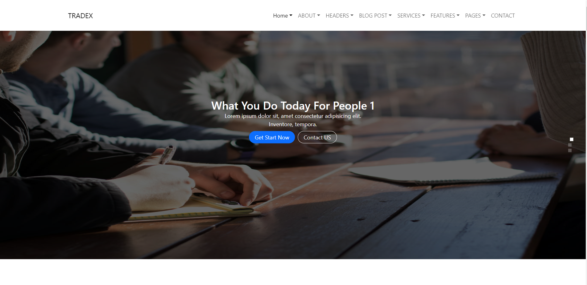
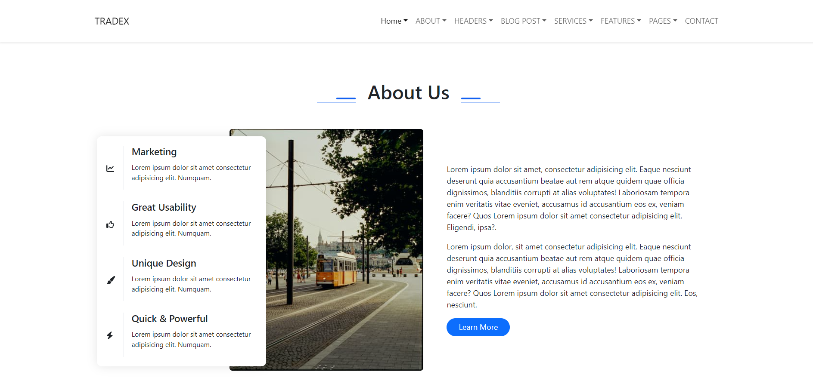
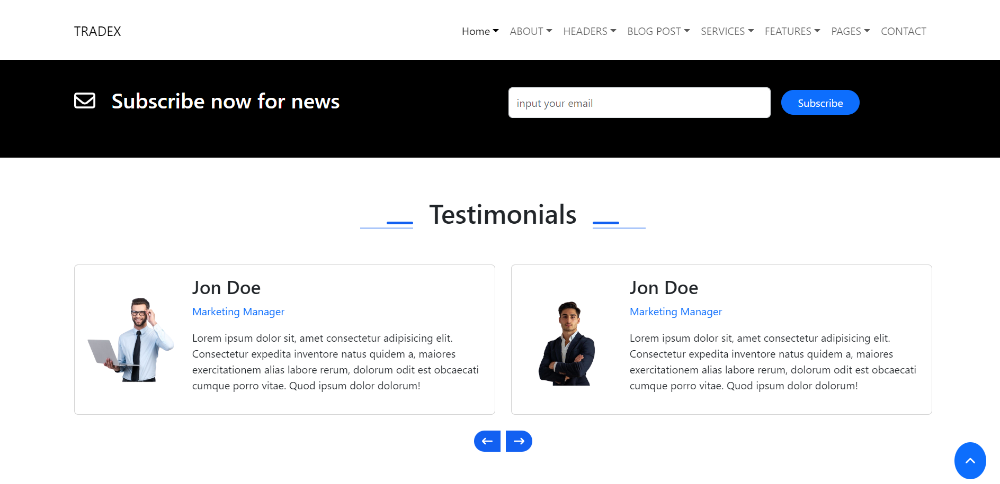

# Tradex - Responsive Website 🌐

Tradex is a fully responsive website developed as part of a task during the DEPI Internship. It is not a real-world project but serves as a demonstration of front-end development skills using HTML, CSS, Bootstrap, and a little bit of JavaScript.

---

## Demo

You can check out the live demo of the project here:  
👉 [Live Demo](https://asemyasser.github.io/Tradex-project/)

---

## Features

- **Fully Responsive Design**: Optimized for all devices (desktop, tablet, and mobile).
- **Modern UI**: Clean and user-friendly interface built with Bootstrap.
- **Interactive Elements**: Subtle JavaScript enhancements for better user interaction.

---

## Technologies Used

- **Frontend**: HTML, CSS, JavaScript
- **Styling Framework**: Bootstrap
- **Responsive Design**: Media queries and Bootstrap grid system
- **JavaScript**: Used for basic interactivity

---

## Installation

Since this is a custom HTML, CSS, and JavaScript project, you can simply clone the repository and open the `index.html` file in your browser.

1. Clone the repository:
   ```bash
   git clone https://github.com/Asemyasser/Tradex-project.git
   ```

2. Navigate to the project directory:
   ```bash
   cd Tradex-project
   ```

3. Open the index.html file in your browser:
   ```bash
   open index.html
   ```

---

## Screenshots

### Slider Section


### About Us


### Testimonials Slider


---
